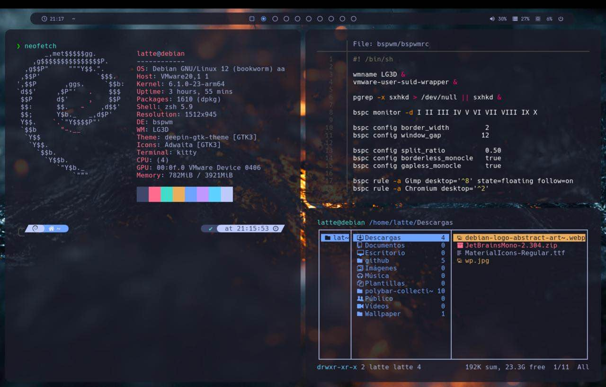
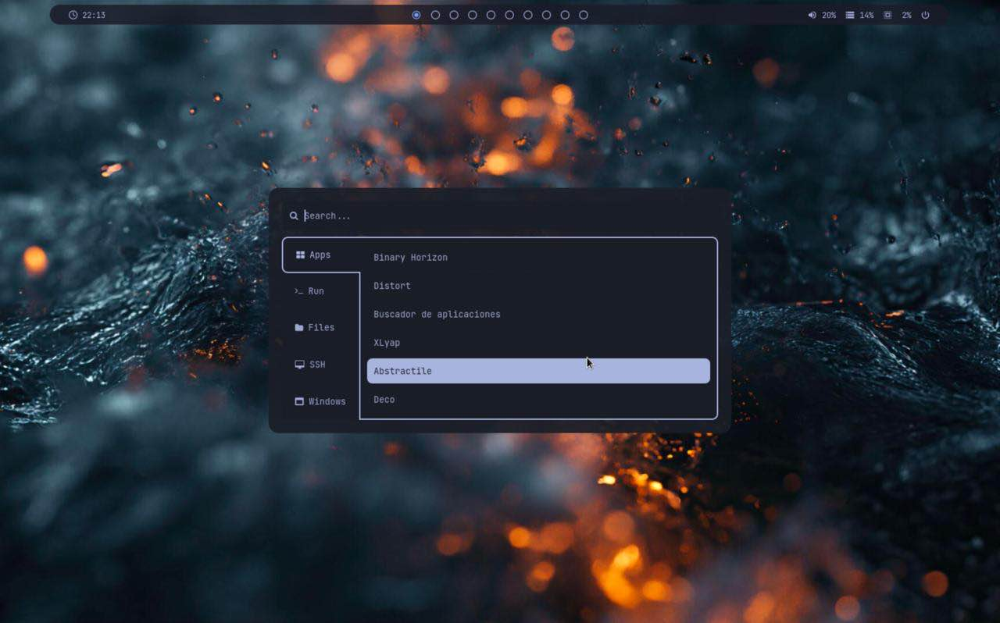
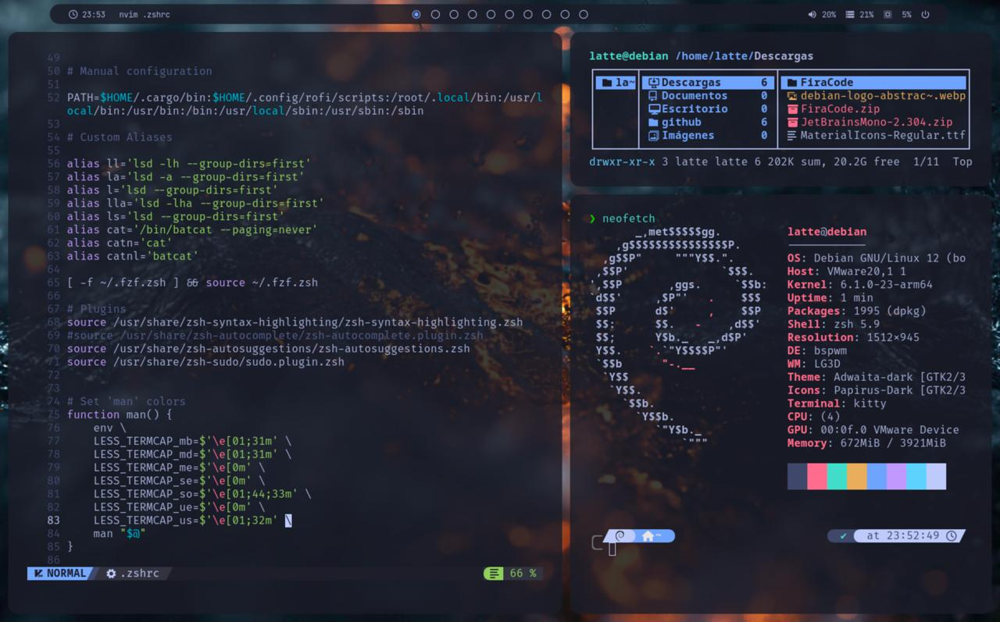

# Mis Dotfiles
Esta es la configuración que actualmente estoy usando en Debian 12 (arm64).

## El entorno
**WM**: bspwm

**Panel**: Polybar

**Launcher** Rofi (temas de [adi1090x](https://github.com/adi1090x/rofi)

**Editor**: NeoVim (Con NvChad)

**Terminal**: Kitty

**Shell**: zsh

**File Manager**: Ranger

## Screenshots

## Instalación
(Próximamente)

